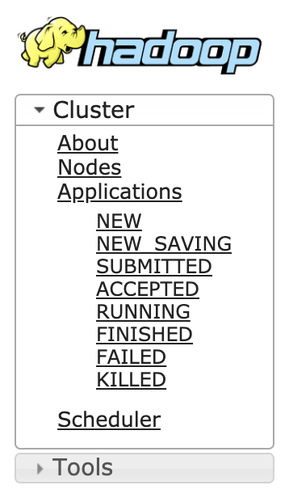

# YARN 任务跟踪探明 - ResourceManager 出场

## **ApplicationMaster**

在了解了 ResourceManager 的基本功能和组件之后，便可以探究 ResourceManager 将如何处理用户提交的请求了。此处需要明确一个问题，那就是客户端提交给 YARN 的应用，到底是什么？

### **客户端提交给 YARN 的应用，到底是什么？**

在 [Client 是如何完成 Spark 任务的构造和提交的](./3.&#32;Client.md) 一篇中，截取了 Client 运行过程中打印的日志截图，其中 Command 中已经高亮了这个应用真正运行的主类：[org.apache.spark.deploy.yarn.ApplicationMaster](https://github.com/apache/spark/blob/v2.3.0/resource-managers/yarn/src/main/scala/org/apache/spark/deploy/yarn/ApplicationMaster.scala#L55).

需要注意的是，这个主类并不是我们所书写的 Spark 程序，而是 Spark 早已经为我们提供了的一个 ***ApplicationMaster***.

那么什么是 ***ApplicationMaster*** 呢？

### **ApplicationMaster 是什么**

ApplicationMaster 实际上是一个特定的计算框架的库，负责与 ResourceManager 协商资源，与 NodeManager 管理和监控任务运行。
想要基于 YARN 开发一套计算框架，比如当下流行的 MR 与 SPARK，首先需要实现的就是 ApplicationMaster 这个类。这个类是“计算框架”启动的入口，而“计算框架”能够运行的前提条件便是需要遵循 YARN 规范的协议，完成自身框架下的资源和任务管理工作。

### **ApplicationMaster 需要做什么**

1. 与 ResourceManager 进行通信，并向 ResourceManager 注册自己
2. 向 ResourceManager 定期发送心跳
3. 向 ResourceManager 申请计算资源(container)来真正地完成用户所提交任务的运行
4. 设置 ContainerLaunchContext 来启动申请下来的 container, 并运行客户程序
5. 监控已经启动的 container
6. 当任务结束后，向 ResourceManager 回报结束态

由此可见，ApplicationMaster 是一个 YARN 应用真正的 leader，他需要负责申请资源，启动并管理计算任务，回报心跳等等。而 [第二篇](./3.&#32;Client.md) 中通过 Spark-Yarn Client 所申请的资源，配置的 ENV，准备的依赖文件和启动命令，完全是为了能够保证 ApplicationMaster 的正确启动。

当然了，当出现 Container 使用异常的情况下例如 OOM, ResourceManager 还是会直接将 Container kill 掉，毕竟 ResourceManager 才是整个 YARN 集群的“主宰”，ApplicationMaster 需要对自己的应用负责，而 ResourceManager 则需要对整个集群负责。

### **ApplicationMaster 启动流程**

ApplicationMaster 的启动，涉及到整个 YARN 系统内部各个组件的交互，事件的传递以及系统组件内状态机的流转。这个过程完美诠释了 YARN 系统的架构理念以及设计思想，是复杂分布式系统的最佳实践。

下图是 ApplicationMaster 启动过程中，YARN 系统内部各个组件之间的事件流转图。


这是在 YARN 应用管理列表能够看到的应用状态：



后续章节将按照 YARN 应用状态流转的顺序，介绍 ApplicationMaster 启动的完整流程。


* ResourceManager 响应 Client 请求的主角: ClientRMService

    Client 通过 ApplicationClientProtocol 与 ResourceManager ResourceManager 也是通过 ApplicationClientProtocol 接收并完成客户端的请求。

    其中 ClientRMService 是 ResourceManager 中对于 ApplicationClientProtocol 协议的实现，负责处理客户端发来的所有 RPC 请求。

    所以 ResourceManager 所接收到的来自客户端的 submitApplication 请求，便也是由 ClientRMService 来处理。

* YARN 应用们的统一管理者: RMAppManager
  
    RMAppManager 是一个管家，为 ResourceManager 管理应用。

    所以 ClientRMService 接收到的应用请求，需要直接交给 RMAppManager 代为处理。

    1. RMAppManager 为应用新建实例
   
        RMAppManager 首先会为新应用创建一个 RMAppImpl 实例用来存储该应用的各项状态，并将该实例加入到 ResourceManager 应用列表中。

        应用列表维护在 rmContext(关于 rmContext 更多信息可以回看 [ResourceManager 有什么](./4.&#32;RM.md) 篇)中，是一个以 ApplicationId 作为 KEY 的 ConcurrentMap:
        ```
        RMAppImpl application = new RMAppImpl(...);
        rmContext.getRMApps().putIfAbsent(applicationId, application)
        ```
        RMAppImpl 实例也是 RMAppManager 用来完成应用管理的直接操作对象。

    2. RMAppManager 为应用新建 `RMAppEvent` 事件，并指定事件类型为 `RMAppEventType.START`

        ```java
        rmContext.getDispatcher().getEventHandler().handle(
            new RMAppEvent(event.getApplicationId(), 
            RMAppEventType.START)
        );
        ```

    3. `RMAppEvent` 事件会由 Dispatcher 根据事件类型，派发给正确的“事件处理器”来处理，流程如下：

        1. RM 中的 AsyncDispatcher 会根据 RMAppEvent 这个事件类型，找到对应的事件派发器：ApplicationEventDispatcher 
        2. AsyncDispatcher 会触发 ApplicationEventDispatcher 的 handle 方法
        3. handle 中会先根据 AppId 找到这个应用的实例：RMAppImpl，然后将 RMAppEvent 交给这个应用实例来处理

        ```java
        public static final class ApplicationEventDispatcher implements EventHandler<RMAppEvent> {

            private final RMContext rmContext;
            public ApplicationEventDispatcher(RMContext rmContext) {
                this.rmContext = rmContext;
            }

            @Override
            public void handle(RMAppEvent event) {
                ApplicationId appID = event.getApplicationId();
                // 找到这个应用实例，将 RMAppEvent 交给应用实例内部的状态机来处理
                RMApp rmApp = this.rmContext.getRMApps().get(appID);
                if (rmApp != null) {
                    try {
                        rmApp.handle(event);
                    } catch (Throwable t) {
                        LOG.error("Error in handling event type " + event.getType()
                        + " for application " + appID, t);
                    }
                }
            }

        }
        ```

        事件派发机制详见：[RM 中的事件机制](./3.2&#32;EventDispatcher.md), 通过产生事件，会触发相应组件的状态机流转，进而再产生动作及事件，联动系统内各个组件。

    4. `RMAppEvent: START` 事件触发应用实例内部的状态机流转

        `NEW --> NEW_SAVINGH` :

        ```
        .addTransition(RMAppState.NEW, RMAppState.NEW_SAVING,
        RMAppEventType.START, new RMAppNewlySavingTransition())
        ```


        


    RMContext

    YarnScheduler
    


### ***Reference***

本篇主要参考 RMAppManager 源码：[org.apache.hadoop.yarn.server.resourcemanager.RMAppManager](https://github.com/apache/hadoop/blob/release-2.7.4-RC0/hadoop-yarn-project/hadoop-yarn/hadoop-yarn-server/hadoop-yarn-server-resourcemanager/src/main/java/org/apache/hadoop/yarn/server/resourcemanager/RMAppManager.java#L65)

### ***下一篇***


