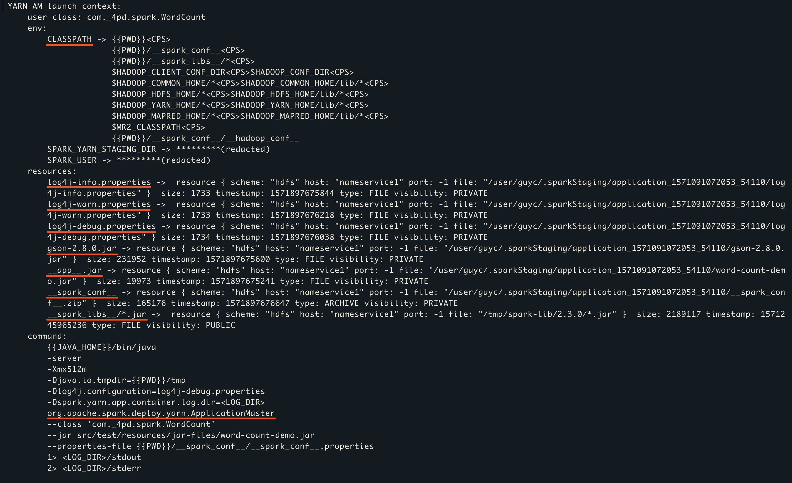
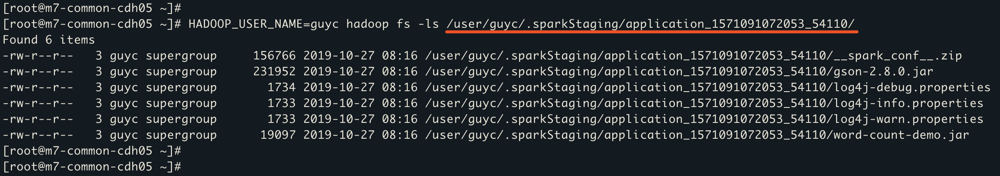
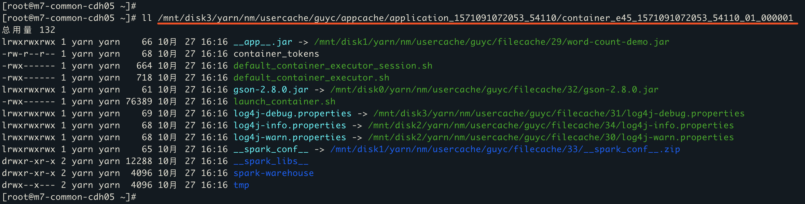
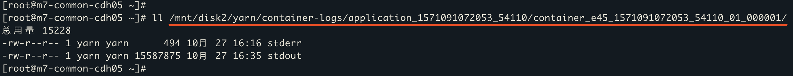

# YARN 任务跟踪探明 (二)

## **主线：向 YARN 提交 Spark 应用**

* [Client 是如何完成 Spark 任务的构造和提交的](./2.&#32;Client.md#1)
* [Client 存在的目的](./2.&#32;Client.md#2)
* [Client 到底做了什么](./2.&#32;Client.md#3)
* [Spark 应用提交示例](./2.&#32;Client.md#4)
* [附: Spark ApplicationMaster 资源设置策略](./2.&#32;Client.md#5)
* [附: ApplicationMaster CLASS_PATH 设置规则](./2.&#32;Client.md#6)
* [附: 分布式缓存](./2.&#32;Client.md#7)
* [相关链接](./2.&#32;Client.md#8)

<br><h3 id="1"><b>Client 是如何完成 Spark 任务的构造和提交的</b></h3>

想要完成向 YARN 提交一个任务, 不同的计算框架会提供不同的提交方式, 但是所有的方式都需要遵循 Yarn Application 的提交原则: [Writing YARN Applications](http://hadoop.apache.org/docs/stable/hadoop-yarn/hadoop-yarn-site/WritingYarnApplications.html)
. 本篇将借用 Spark 官方提供的 Spark-Yarn Client 来作为 YARN Application 提交原则的最佳实践, 由此来说明一个 YARN 应用的正确提交流程。

<br><h3 id="2"><b>Client 存在的目的</b></h3>

1. 通过集群配置文件 hadoop-conf 与目标 YARN 集群的 ResourceManager 进行通信。
2. 向 ResourceManager 提交自定义 YARN 应用

此处的 YARN 应用须包括以下三个方面: 
1. 应用参数配置, 包括应用运行的环境变量, 应用所需的资源配置, 应用本身接收的参数等
2. 应用运行时需要依赖的文件, 本例中是 log4j 的配置文件以及第三方 Jar 包, 也可以是 zip, tar 包等其他任何文件
3. 可执行文件, 本例中是 word-count-demo.jar 这个包, 也可以是 Python, R 文件等

由此引出的三个问题: 
1. YARN 集群是如何启动解析和处理所提交应用的参数配置?
2. YARN 集群是如何发现, 管理和使用应用运行时需要依赖的那些文件的?
3. YARN 集群是如何启动并运行应用提交的可执行文件的?

<br><h3 id="3"><b>Client 到底做了什么 (按时间序)</b></h3>

1. 首先, 要想与 YARN ResourceManager 进行通信, 就需要遵循 ResourceManager 的 RPC 协议, 此协议名为 ApplicationClientProtocol。关于更多 ResourceManager 中的 RPC 协议及其作用, 详见 [ResourceManager](./4.&#32;RM.md)

    Yarn 官方也提供了一个 YarnClient, 具体实现为 YarnClientImpl。YarnClientImpl 可以通过 ApplicationClientProtocol RPC 协议与 ResourceManager 通信, 其中 YarnClient 对具体 ApplicationClientProtocol 的实现是使用 ClientResourceManagerProxy 代理来完成的。
    
    此处需要区别 Spark 提供的 Client 与 YarnClient 。<br>
    [org.apache.spark.deploy.yarn.Client](https://github.com/apache/spark/blob/v2.3.0/resource-managers/yarn/src/main/scala/org/apache/spark/deploy/yarn/Client.scala#L59) 是对 [org.apache.hadoop.yarn.client.api.YarnClient](https://github.com/apache/hadoop/blob/release-2.7.4-RC0/hadoop-yarn-project/hadoop-yarn/hadoop-yarn-client/src/main/java/org/apache/hadoop/yarn/client/api/YarnClient.java#L68) 的再封装, 在调用 YarnClient 提交一个 ResourceManager 能够接受的应用之前, 还需要按照 YARN 应用的提交流程做一些预处理, 如鉴权, 资源校验, 文件准备, 按照 RPC 协议封装请求等操作。
    
    所以 Client 需要做的第一件事, 就是初始化一个 YarnClient。

    ```
    YarnClient yarnClient = YarnClient.createYarnClient();
    yarnClient.init(conf);
    yarnClient.start();
    ```

2. 使用 yarnClient 创建一个 yarn 应用
    ```
    YarnClientApplication app = yarnClient.createApplication();
    GetNewApplicationResponse appResponse = app.getNewApplicationResponse();
    ```
    GetNewApplicationResponse 中可以获得两个信息
    1. ApplicationId, 作为本次提交应用的唯一标识
        ```
        ApplicationId appId = newAppResponse.getApplicationId();
        ```
    2. MaximumResourceCapability, 表示集群最大可使用的资源信息, 包括 VirtualCores 和 Memory
        ```
        Resource maxResource = newAppResponse.getMaximumResourceCapability();
        int maxMem = maxResource.getMemory();
        int maxCores = maxResource.getVirtualCores()
        ```
        [详见 Spark ApplicationMaster 资源设置策略]()

3. 遵循 ApplicationClientProtocol 协议, 设置 appContext: ApplicationSubmissionContext, 此中包含了 ResourceManager 用来启动 ApplicationMaster 的全部必要信息
   
    1. 应用信息: ApplicationName, ApplicationType, ApplicationTags, Queue, Priority, MaxAppAttempts(spark.yarn.maxAppAttempts=1)
    2. 资源信息: Memory, VirtualCores, 
    3. Container 启动的必要信息: ContainerLaunchContext
       1. 设置 Environment
          1. PWD=/mnt/disk3/yarn/nm/usercache/work/appcache/application_id/container_id/
          2. CLASS_PATH, 详见 [ApplicationMaster CLASS_PATH 设置规则]()
          3. SPARK_YARN_MODE="true"
          4. SPARK_YARN_STAGING_DIR=.sparkStaging/appId
          5. SPARK_USER=UGI.getCurrentUser().getShortUserName()
          6. ENV + spark.yarn.appMasterEnv.
          7. PYTHONPATH=PWD/__pyfiles__
          8. SPARK_DIST_CLASSPATH
       2. 准备本地资源文件, 创建 .staging 目录, 并将本地文件通过[分布式缓存](TODO)分发到节点
          1. spark.yarn.keytab -> `PWD/keytab-UUID`
          2. spark.yarn.archive -> `PWD/__spark_libs__`
          3. 如果 archive 为空, 准备 spark.yarn.jars -> `PWD/__spark_libs__`
          4. 如果 spark.yarn.jars 为空, 准备 SPARK_HOME 下的 lib -> `PWD/__spark_libs__`
          5. --Jar 指定的 Jar 包 -> spark.yarn.user.jar -> `PWD/__app__.jar`
          6. spark.yarn.dist.jars -> `PWD`
          7. spark.yarn.dist.files -> `PWD`
          8. spark.yarn.dist.archives -> `PWD`
          9. spark.yarn.dist.pyFiles -> `PWD/__pyfiles__`
          10. --primary-py-file -> `PWD`
          11. HADOOP_CONF_DIR/* -> `PWD/__spark_conf__/__hadoop_conf__`
          12. SPARK_CONF_DIR/*.xml -> `PWD/__spark_conf__/__hadoop_conf__`
          13. YARN_CONF_DIR/* -> `PWD/__spark_conf__/__hadoop_conf__`
          14. `log4j.properties` -> `PWD/__spark_conf__/log4j.properties`
          15. 所有的 HADOOP_CONF 会写成一个文件: `__spark_hadoop_conf__.xml` -> `PWD/__spark_conf__/__spark_hadoop_conf__.xml`
          16. 所有的 SPARK_CONF 会写成一个文件: `__spark_conf__.properties` -> `PWD/__spark_conf__/__spark_conf__.properties`
       3. Jvm options
            ```
            -server
            -Xmx512m    # "-Xmx" + spark.driver.memory + "m"
            -Djava.io.tmpdir={{PWD}}/tmp
            -Dlog4j.configuration=log4j-debug.properties
            -Dspark.yarn.app.container.log.dir=<LOG_DIR>
            ```
       4. Command
            ```
            {{JAVA_HOME}}/bin/java
            -server
            -Xmx512m
            -Djava.io.tmpdir={{PWD}}/tmp
            -Dlog4j.configuration=log4j-debug.properties
            -Dspark.yarn.app.container.log.dir=<LOG_DIR>
            org.apache.spark.deploy.yarn.ApplicationMaster
            --class 'com._4pd.spark.WordCount'
            --jar src/test/Resources/jar-files/word-count-demo.jar
            --properties-file {{PWD}}/__spark_conf__/__spark_conf__.properties
            1> <LOG_DIR>/stdout
            2> <LOG_DIR>/stderr
            ```
4. 通过 yarnClient 向 ResourceManager 提交应用
    ```
    yarnClient.submitApplication(appContext)
    ```

<br><h3 id="4"><b>Spark 应用提交示例</b></h3>

运行 Demo 程序, 并开启 DEBUG 日志, Client 会将 ContainerLaunchContext 信息打印出来, 分别对应: 
1. Environment 的设置
2. 本地资源文件的准备与上传
3. JvmOpt 与可执行命令的设置



应用成功提交到 Yarn 集群之后，Yarn 会为这个应用产生一个 .staging 目录，负责存放应用相关依赖文件：



根据 Demo 任务中实时打印出来的日志，能够找到真正执行所 AM 的那一台物理机，并能够根据 ENV: PWD 直接确定应用运行的当前目录：



可以看到应用 PWD 下存在以下 4 类文件，这些文件是一个 AM 启动的全部信息：

1. 应用提交时指定的 `__spark_libs__ `
2. yarn 以及 spark 配置文件：`__spark_conf__`
3. 应用提交时携带的本地依赖文件，包括 Jar 包，配置文件以及第三方依赖等
4. 应用进程的启动命令：`*.sh`

关于 AM 启动命令中所指定的日志收集路径，可以在 AM 所启动的物理机上找到：



这两份日志文件会被 Yarn 统一收集聚合起来，更多关于 Yarn 日志收集相关配置：

| Property Name | Default | Meaning |
|:--|:--|:--|
| yarn.log-aggregation-enable | false | Whether to enable log aggregation. Log aggregation collects each container's logs and moves these logs onto a file-system, for e.g. HDFS, after the application completes. Users can configure the "yarn.nodemanager.remote-app-log-dir" and "yarn.nodemanager.remote-app-log-dir-suffix" properties to determine where these logs are moved to. Users can access the logs via the Application Timeline Server. |
| yarn.nodemanager.remote-app-log-dir | /tmp/logs | Where to aggregate logs to. |
| yarn.log-aggregation.retain-seconds | -1 | How long to keep aggregation logs before deleting them. -1 disables. Be careful set this too small and you will spam the name node. |
| yarn.log-aggregation.retain-check-interval-seconds | fa-1lse | How long to wait between aggregated log retention checks. If set to 0 or a negative value then the value is computed as one-tenth of the aggregated log retention time. Be careful set this too small and you will spam the name node. |

<br><h3 id="5"><i><b>附: Spark ApplicationMaster 资源设置策略</b></i></h3>

* amMem = spark.driver.memory + spark.driver.memoryOverhead<br>
    MEMORY_OVERHEAD_MIN = 384<br>
    MEMORY_OVERHEAD_FACTOR = 0.10<br>
    spark.driver.memoryOverhead = math.max(MEMORY_OVERHEAD_FACTOR * spark.driver.memory, MEMORY_OVERHEAD_MIN)
* amCores = spark.yarn.am.cores

<br><h3 id="6"><i><b>附: ApplicationMaster CLASS_PATH 设置规则</b></i></h3>

1. CLASS_PATH 初始为空, CLASS_PATH 之间的分隔符是 <CPS>, 意为 CLASS_PATH_SEPARATOR
2. CLASS_PATH += spark.driver.extraClassPath, spark.driver.extraClassPath 可以为空
3. CLASS_PATH += 任务当前路径 PWD
4. CLASS_PATH += PWD/__spark_conf__, __spark_conf__ 中包含用户提交的 spark conf 和 hadoop conf
5. CLASS_PATH += PWD/__spark_libs__, __spark_libs__ 中包含所有 spark libs, 相当于 spark 1.x 中的 spark-assembly.jar
6. CLASS_PATH += yarn.application.classpath
7. CLASS_PATH += mapreduce.application.classpath
8. CLASS_PATH += SPARK_DIST_CLASSPATH (env)
9. CLASS_PATH += {{PWD}}/__spark_conf__/__hadoop_conf__

<br><h3 id="7"><i><b>附: Districuted Cache</b></i></h3>

Hadoop 提供了一种文件缓存机制，可以缓存小到中等只读文件，如文本文件、zip文件、jar文件等，并将它们分发到运行任务的工作节点。每个数据节点都会通过分布式缓存得到文件副本。

可缓存并分发的文件种类：
1. 本地文件，首先将缓存文件上传到 HDFS 的某一目录下，再分发到各个节点上的
2. Hdfs 文件，无需上传，可以直接分发到各个节点上的

可接收的文件类型：
1. file 文件，不做任何处理
2. archive 文件，后缀为“.jar”、“.zip”，“.tar.gz”、“.tgz”的文件会被自动解压，可以添加 '#' 作为分隔符来指定解压后的文件夹名字
3. lib-jar 文件，会被直接放置在 CLASSPATH 下

<br><h3 id="8"><b><i>相关链接</i></b></h3>

* [Writing YARN Applications](http://hadoop.apache.org/docs/stable/hadoop-yarn/hadoop-yarn-site/WritingYarnApplications.html)
* [Spark-Yarn Client 源代码](https://github.com/apache/spark/blob/v2.3.0/resource-managers/yarn/src/main/scala/org/apache/spark/deploy/yarn/Client.scala#L144)
* [core 默认配置](http://hadoop.apache.org/docs/r2.7.4/hadoop-project-dist/hadoop-common/core-default.xml)
* [Hdfs 默认配置](http://hadoop.apache.org/docs/r2.7.4/hadoop-project-dist/hadoop-hdfs/hdfs-default.xml)
* [Yarn 默认配置](http://hadoop.apache.org/docs/r2.7.4/hadoop-yarn/hadoop-yarn-common/yarn-default.xml)
* [Mapred 默认配置](http://hadoop.apache.org/docs/r2.7.4/hadoop-mapreduce-client/hadoop-mapreduce-client-core/mapred-default.xml)
* [DeprecatedProperties](http://hadoop.apache.org/docs/r2.7.4/hadoop-project-dist/hadoop-common/DeprecatedProperties.html)

<br>

---

<br>

在调用 YarnClient 完成了应用提交动作之后, 应用的请求信息便通过 RPC 协议提交到 ResourceManager, 接下来将先介绍 ResourceManager 有什么, 然后会介绍 ResourceManager 对于客户端提交的应用的处理过程。「[传送门](./3.&#32;ResourceManager.md)」

### **[回到目录](./README.md)**