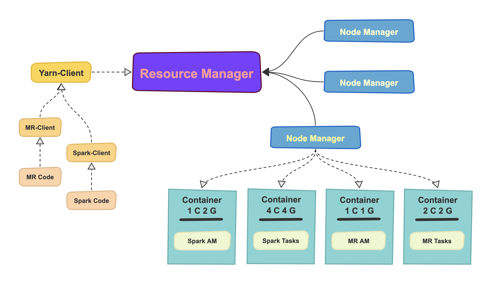
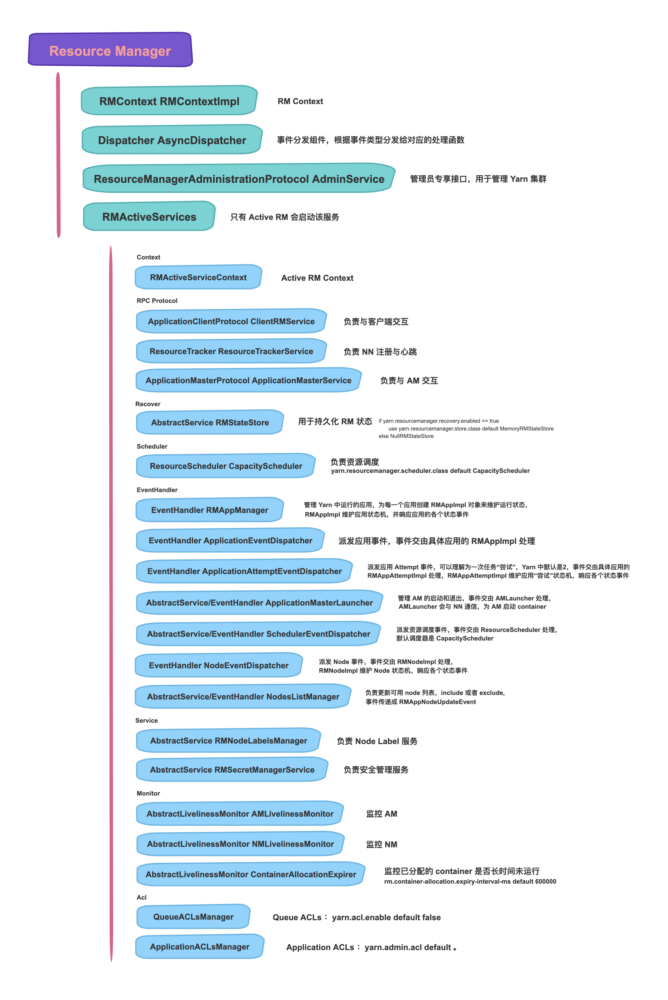

# YARN 任务跟踪探明 (三)

<br>

## **主线: ResourceManager 出场**

* [ResourceManager 的地位](./3.&#32;ResourceManager.md#1)
* [ResourceManager 有什么特性](./3.&#32;ResourceManager.md#2)
* [ResourceManager 通过什么方式来完成上述特性](./3.&#32;ResourceManager.md#3)
* [ResourceManager 内部有什么组件](./3.&#32;ResourceManager.md#4)
* [相关链接](./3.&#32;ResourceManager.md#5)

<br><h3 id="1"><b>ResourceManager 的地位</b></h3>

在 ResourceManager 出场之前，先放一张图：



图中描绘了 YARN 体系架构略要，不过关于其中的各个组件以及作用，暂时先按住不表，先来看一下图中的 C 位核心：**ResourceManager**

在上一篇中介绍了向 YARN 提交一个应用程序的正确流程, 至此, 请求便到达了 YARN 集群, 客户端也就完成了提交应用的全部动作。而在 YARN 集群中, 能够接收并响应客户端请求的角色只有一个, 那就是 ResourceManager. 本篇将先简要介绍 ResourceManager 的基本功能和组件。在后续篇章中会再介绍 ResourceManager 是如何处理客户端请求的。

<br><h3 id="2"><b>ResourceManager 有什么特性</b></h3>

1. 管理 NodeManager, 详见：[「支线」ResourceManager 之 NodeManager (TODO)](./3.3&#32;RMHignAvaliable.md)
2. 启动 ApplicationMaster, 管理其资源和状态，详见：[「主线」ApplicationMaster 出场](./4.&#32;ApplicationMaster.md)
3. 响应 Client

<br><h3 id="3"><b>ResourceManager 通过什么方式来完成上述特性</b></h3>

在 Yarn 集群中, 各个组件以及客户端都是通过 RPC 来互相通信, 遵循不同的 RPC 接口可以完成不同的动作。

针对于以上三个特性, 分别采用的 RPC 协议如下：

1. **ResourceTracker, 用来完成 NodeManager 的注册与心跳汇报**
    * 所属包：[org.apache.hadoop.yarn.proto](https://github.com/apache/hadoop/blob/release-2.7.4-RC0/hadoop-yarn-project/hadoop-yarn/hadoop-yarn-server/hadoop-yarn-server-common/src/main/java/org/apache/hadoop/yarn/server/api/ResourceTracker.java)
    * 主要接口：

        * NodeManager 注册接口
            ```
            RegisterNodeManagerResponse registerNodeManager(RegisterNodeManagerRequest request)
            ```
        * NodeManager 心跳回报接口
            ```
            NodeHeartbeatResponse nodeHeartbeat(NodeHeartbeatRequest request)
            ```

2. **ApplicationMasterProtocol, 用来启动和管理 ApplicationMaster, 以及为 ApplicationMaster 分配资源**
    * 所属包：[org.apache.hadoop.yarn.api](https://github.com/apache/hadoop/blob/release-2.7.4-RC0/hadoop-yarn-project/hadoop-yarn/hadoop-yarn-api/src/main/proto/applicationmaster_protocol.proto#L34)
    * 主要接口：

        * ApplicationMaster 向 ResourceManager 注册接口
            ```java
            RegisterApplicationMasterResponse registerApplicationMaster(RegisterApplicationMasterRequest request)
            ```
        * ApplicationMaster 向 ResourceManager 通知其结束 (成功或失败)
            ```java
            FinishApplicationMasterResponse finishApplicationMaster(FinishApplicationMasterRequest request)
            ```
        * ApplicationMaster 向 ResourceManager 提供其需要**申请的资源列表**, 并返回其已经分配但未使用的 Container, 同时这个接口也会作为 ApplicationMaster 的**心跳汇报接口**, 通过定时汇报心跳来告诉 ResourceManager 自己还活着, 心跳频率由参数 `yarn.am.liveness-monitor.expiry-interval-ms` 控制, 默认值是 600000, 也就是 1 分钟
            ```java
            AllocateResponse allocate(AllocateRequest request)
            ```

        
3. **ApplicationClientProtocol, 用来响应客户端的请求, 包括创建, 提交和管理应用, 提交, 更新资源预留, 以及获取集群和队列信息等**
    * 所属包：[org.apache.hadoop.yarn.api](https://github.com/apache/hadoop/blob/release-2.7.4-RC0/hadoop-yarn-project/hadoop-yarn/hadoop-yarn-api/src/main/java/org/apache/hadoop/yarn/api/ApplicationClientProtocol.java#L75)
    * 主要接口：

        * 客户端用来向 ResourceManager 创建一个新应用, 并且获得这个新应用的 ApplicationId
            ```java
            GetNewApplicationResponse getNewApplication(GetNewApplicationRequest request)
            ```
        * 客户端用来向 ResourceManager 提交新应用
            ```java
            SubmitApplicationResponse submitApplication(SubmitApplicationRequest request)
            ```
        * 客户端用来向 ResourceManager 申请停止一个 YARN 应用
            ```java
            KillApplicationResponse forceKillApplication(KillApplicationRequest request)
            ```
        * 客户端用来从 ResourceManager 获取集群指标信息
            ```java
            GetClusterMetricsResponse getClusterMetrics(GetClusterMetricsRequest request)
            ```
        * 客户端用来从 ResourceManager 获取集群所有节点的报告
            ```java
            GetClusterNodesResponse getClusterNodes(GetClusterNodesRequest request)
            ```
        * 客户端用来从 ResourceManager 获取集群队列信息
            ```java
            GetQueueInfoResponse getQueueInfo(GetQueueInfoRequest request)
            ```
        * 客户端用来从 ResourceManager 获取当前用户的队列访问控制信息
            ```java
            GetQueueUserAclsInfoResponse getQueueUserAcls(GetQueueUserAclsInfoRequest request)
            ```
        * 客户端用来向 ResourceManager 申请将一个应用移动到新的队列
            ```java
            MoveApplicationAcrossQueuesResponse moveApplicationAcrossQueues(MoveApplicationAcrossQueuesRequest request)
            ```
        * 客户端用来向 ResourceManager 提交一个新的资源预留
            ```java
            ReservationSubmissionResponse submitReservation(ReservationSubmissionRequest request)
            ```
        * 客户端用来向 ResourceManager 申请更新一个已存在的资源预留
            ```java
            ReservationUpdateResponse updateReservation(ReservationUpdateRequest request)
            ```
        * 客户端用来向 ResourceManager 申请删除一个已存在的资源预留
            ```java
            ReservationDeleteResponse deleteReservation(ReservationDeleteRequest request)
            ```
        * 客户端用来从 ResourceManager 获取节点对应的 Label 集合
            ```java
            GetNodesToLabelsResponse getNodeToLabels(GetNodesToLabelsRequest request)
            ```
        * 客户端用来从 ResourceManager 获取 Label 对应的节点集合
            ```java
            GetLabelsToNodesResponse getLabelsToNodes(GetLabelsToNodesRequest request)
            ```
        * 客户端用来从 ResourceManager 获取集群中所有节点的 Label
            ```java
            GetClusterNodeLabelsResponse getClusterNodeLabels(GetClusterNodeLabelsRequest request)
            ```

<br><h3 id="4"><b>ResourceManager 内部有什么组件</b></h3>

示意图中的组件主要有以下几个分类：
1. 运行时上下文 (rmContext), 记录所有组件和应用的状态, 更多详见：[「支线」ResourceManager 之 RMContext](./3.1&#32;RMContext.md)
2. RPC 协议的实现类 (RPC Protocol), 用于各端的请求收发
3. 资源调度器 (ResourceScheduler), 
4. 事件分发组件 (Dispatcher), 用于将 RM 内部各种事件派发给相应的事件处理器中, 更多详见：[「支线」ResourceManager 之事件机制](./3.2&#32;EventDispatcher.md)
5. 事件处理组件 (EventHandler), 按照事件类别可以分为多种, 每一种只处理特定事件, 更多详见：[「支线」ResourceManager 之事件机制](./3.2&#32;EventDispatcher.md)
6. 管理类服务 (Recover&Service), 属于系统级别常驻服务
7. 访问控制服务 (Acls), 用于对应用或队列进行访问控制
8. 监控组件 (Monitor), 用于监控 AM, NM, AM

组件具体实现与功能详见下图：



<br><h3 id="5"><b><i>相关链接</i></b></h3>

* [org.apache.hadoop.yarn.server.resourcemanager.ResourceManager](https://github.com/apache/hadoop/blob/release-2.7.4-RC0/hadoop-yarn-project/hadoop-yarn/hadoop-yarn-server/hadoop-yarn-server-resourcemanager/src/main/java/org/apache/hadoop/yarn/server/resourcemanager/ResourceManager.java#L112)

<br>

---

<br>

在介绍了 ResourceManager 大体组件以及功能之后, 接下来会探究 ResourceManager 将如何处理 Client 提交的应用。「[传送门](./4.&#32;ApplicationMaster.md)」

### **[回到目录](./README.md)**


