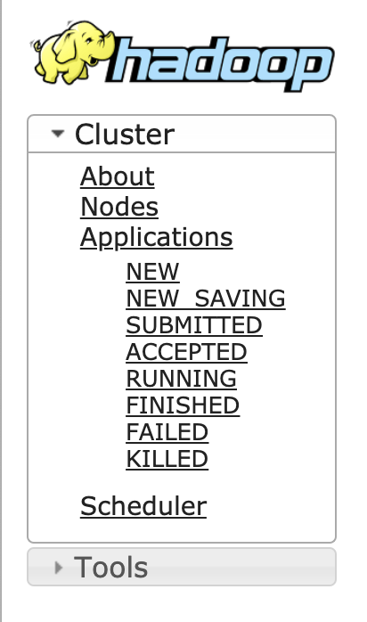

# YARN 任务跟踪探明 (四)

 

## 主线: ApplicationMaster 出场

* [客户端提交给 YARN 的应用，到底是什么？](./4.&#32;ApplicationMaster.md#1)
* [ApplicationMaster 是什么？](./4.&#32;ApplicationMaster.md#2)
* [ApplicationMaster 需要做什么？](./4.&#32;ApplicationMaster.md#3)
* [ApplicationMaster 启动流程](./4.&#32;ApplicationMaster.md#4)
* [相关链接](./4.&#32;ApplicationMaster.md#5)

 <h3 id="1"><b>客户端提交给 YARN 的应用，到底是什么？</b></h3>

在了解了 ResourceManager 的基本功能和组件之后，便可以探究 ResourceManager 将如何处理用户提交的请求了。此处需要明确一个问题，那就是客户端提交给 YARN 的应用，到底是什么？

在 [「主线」向 YARN 提交 Spark 应用](./2.&#32;Client.md) 一篇中，截取了 Client 运行过程中打印的日志截图，其中 Command 中已经高亮了这个应用真正运行的主类：[org.apache.spark.deploy.yarn.ApplicationMaster](https://github.com/apache/spark/blob/v2.3.0/resource-managers/yarn/src/main/scala/org/apache/spark/deploy/yarn/ApplicationMaster.scala#L55).

需要注意的是，这个主类并不是我们所书写的 Spark 程序，而是 Spark 早已经为我们提供了的一个 ***ApplicationMaster***.

那么什么是 ***ApplicationMaster*** 呢？

 <h3 id="2"><b>ApplicationMaster 是什么？</b></h3>

ApplicationMaster 实际上是一个特定的计算框架的库，负责与 ResourceManager 协商资源，与 NodeManager 管理和监控任务运行。
想要基于 YARN 开发一套计算框架，比如当下流行的 MR 与 SPARK，首先需要实现的就是 ApplicationMaster 这个类。这个类是“计算框架”启动的入口，而“计算框架”能够运行的前提条件便是需要遵循 YARN 规范的协议，完成自身框架下的资源和任务管理工作。

 <h3 id="3"><b>ApplicationMaster 需要做什么？</b></h3>

1. 与 ResourceManager 进行通信，并向 ResourceManager 注册自己
2. 向 ResourceManager 定期发送心跳
3. 向 ResourceManager 申请计算资源(container)来真正地完成用户所提交任务的运行
4. 设置 ContainerLaunchContext 来启动申请下来的 container, 并运行客户程序
5. 监控已经启动的 container
6. 当任务结束后，向 ResourceManager 回报结束态

由此可见，ApplicationMaster 是一个 YARN 应用真正的 leader，他需要负责申请资源，启动并管理计算任务，回报心跳等等。而在 [「主线」向 YARN 提交 Spark 应用](./2.&#32;Client.md) 一篇中通过 Spark-YARN Client 所申请的资源，配置的 ENV，准备的依赖文件和启动命令，完全是为了能够保证 ApplicationMaster 的正确启动。

当然了，当出现 Container 使用异常的情况下例如 OOM, ResourceManager 还是会直接将 Container kill 掉，毕竟 ResourceManager 才是整个 YARN 集群的“主宰”，ApplicationMaster 需要对自己的应用负责，而 ResourceManager 则需要对整个集群负责。

 <h3 id="4"><b>ApplicationMaster 启动流程</b></h3>

ApplicationMaster 的启动，涉及到整个 YARN 系统内部各个组件的交互，事件的传递以及系统组件内状态机的流转。这个过程完美诠释了 YARN 系统的架构理念以及设计思想，是复杂分布式系统的最佳实践。

下图是 ApplicationMaster 启动过程中，YARN 系统内部各个组件之间的事件流转图。

这是在 YARN 应用管理列表能够看到的应用状态：

事件的流转会触发 YARN 系统中各个组件的状态变更，这及到了 YARN 系统中所有重要组件以及组件之间的交互方式，每一个组件各司其职，并且和谐的沟通交互才完成了一个 YARN 任务的成功调度和运行。

 <h3 id="5"><b><i>相关链接</i></b></h3>

* [org.apache.spark.deploy.yarn.ApplicationMaster](https://github.com/apache/spark/blob/v2.3.0/resource-managers/yarn/src/main/scala/org/apache/spark/deploy/yarn/ApplicationMaster.scala#L55)

 

---

 

YARN 应用的实质是 ApplicationMaster 进程的启动，而启动过程中会触发一个 YARN 应用各个阶段的状态变更，并在每个状态变更的过程，完成“固定的”任务执行逻辑。接下来将介绍 YARN 启动一个新应用的完整生命周期。「[传送门](./5&#32;LaunchAM-1.md)」

### **[回到目录](./README.md)**

