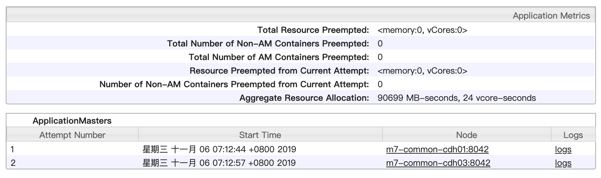

# YARN 任务跟踪探明 (五)

<br>

## 从 NEW 到 ACCEPTED


### 图在先


### 本篇提及到的组件

* ClientRMService
* AsyncDispatcher
* RMAppManager
* RMAppImpl
* RMStateStore
* RMAppAttemptImpl
* CapacityScheduler

### **从接收客户端应用提交请求开始**

ResourceManager 响应 Client 请求的主角: ClientRMService

Client 通过 ApplicationClientProtocol 与 ResourceManager ResourceManager 也是通过 ApplicationClientProtocol 接收并完成客户端的请求。

其中 ClientRMService 是 ResourceManager 中对于 ApplicationClientProtocol 协议的实现，负责处理客户端发来的所有 RPC 请求。

所以 ResourceManager 所接收到的来自客户端的 submitApplication 请求，便也是由 ClientRMService 来处理。

### **请求传递给 YARN 应用的真正管理者：RMAppManager**

RMAppManager 是一个管家，为 ResourceManager 管理应用。当 ClientRMService 接收到的应用请求，需要直接交给 RMAppManager 代为处理。

RMAppManager 在接受到一个应用请求之后，首先需要为该应用创建一个应用实例，然后产生一个应用开始事件，表示一个 YARN 应用的诞生。

1. RMAppManager 为应用新建实例

    RMAppManager 首先会为新应用创建一个 RMAppImpl 实例用来存储该应用的各项状态，并将该实例加入到 ResourceManager 应用列表中。

    应用列表维护在 rmContext(关于 rmContext 更多信息可以回看 [ResourceManager 有什么](./4.&#32;RM.md) 篇)中，是一个以 ApplicationId 作为 KEY 的 ConcurrentMap:
    ```
    RMAppImpl application = new RMAppImpl(...);
    rmContext.getRMApps().putIfAbsent(applicationId, application)
    ```
    RMAppImpl 实例也是 RMAppManager 用来完成应用管理的直接操作对象。

2. RMAppManager 为应用新建 `RMAppEvent` 事件，并指定事件类型为 `RMAppEventType.START`

    ```java
    rmContext.getDispatcher().getEventHandler().handle(
        new RMAppEvent(event.getApplicationId(), 
        RMAppEventType.START)
    );
    ```

    `RMAppEvent` 事件会由 Dispatcher 根据事件类型，派发给正确的“事件处理器”来处理，流程如下：

    1. RM 中的 AsyncDispatcher 会根据 RMAppEvent 这个事件类型，找到对应的事件派发器：ApplicationEventDispatcher 
    2. AsyncDispatcher 会触发 ApplicationEventDispatcher 的 handle 方法
    3. handle 中会先根据 AppId 找到这个应用的实例：RMAppImpl，然后将 RMAppEvent 交给这个应用实例来处理

    ```java
    public static final class ApplicationEventDispatcher implements EventHandler<RMAppEvent> {

        private final RMContext rmContext;
        public ApplicationEventDispatcher(RMContext rmContext) {
            this.rmContext = rmContext;
        }

        @Override
        public void handle(RMAppEvent event) {
            ApplicationId appID = event.getApplicationId();
            // 找到这个应用实例，将 RMAppEvent 交给应用实例内部的状态机来处理
            RMApp rmApp = this.rmContext.getRMApps().get(appID);
            if (rmApp != null) {
                try {
                    rmApp.handle(event);
                } catch (Throwable t) {
                    LOG.error("Error in handling event type " + event.getType()
                    + " for application " + appID, t);
                }
            }
        }

    }
    ```

    事件派发机制详见：[RM 中的事件机制](./3.2&#32;EventDispatcher.md), 通过产生事件，会触发相应组件的状态机流转，进而再产生动作及事件，联动系统内各个组件。

### **从 `NEW` 到 `NEW_SAVING`**

RMAppManager 产生的 `RMAppEventType.START` 事件，在经过派发器的转发会交给具体的应用实例(RMAppImpl)来处理。RMAppImpl 中维护着这个应用的状态机，事件会直接导致状态机的状态流转，而在状态流转的过程中会产生新的动作或者事件。

`RMAppEventType.START` 事件的触发，会产生两个影响：

1. 状态流转触发动作：`new RMAppNewlySavingTransition()`，用来完成 RMAppImpl 信息日志存储

   `new RMAppNewlySavingTransition()` 会触发新的事件：`RMStateStoreEventType.STORE_APP`，事件会被派发到 RMStateStore 中进行处理, 并产生两个影响：

    1. RMStateStore 以日志形式记录 RMAppImpl 信息，用来支持 RM 恢复机制
    2. RMAppImpl 信息记录完成之后，RMStateStore 会向 RMAppImpl 发送 `RMAppEventType.APP_NEW_SAVED` 事件, 继续触发应用状态的下一步流转。

2. 完成本次动作后，应用状态从 `RMAppState.NEW` 转为 `RMAppState.NEW_SAVING`

### **从 `NEW_SAVING` 到 `SUBMITTED`**

`RMAppEventType.APP_NEW_SAVED` 事件的触发，会产生两个影响：

1. 状态流转触发动作：`new AddApplicationToSchedulerTransition()`，将应用交给资源调度器(ResourceScheduler)处理

    RMAppImpl 会向 CapacityScheduler(ResourceScheduler 的默认实现) 发送 `SchedulerEventType.APP_ADDED` 事件。
    
    1. CapacityScheduler 接收到事件后，会先基于应用指定的队列信息进行一系列检查，然后将应用提交到指定 YARN 队列中。
    2. 为应用创建 `SchedulerApplication<FiCaSchedulerApp>` 实例，并将此实例添加到调度器内部的应用 MAP 中，来维护这个应用相关的资源调度信息。
    3. CapacityScheduler 会向 RMAppImpl 发送 `RMAppEventType.APP_ACCEPTED` 事件, 继续触发应用状态的下一步流转。

2. 完成本次动作后，应用状态从 `RMAppState.NEW_SAVING` 转为 `RMAppState.SUBMITTED`

### **从 `SUBMITTED` 到 `ACCEPTED`**

`RMAppEventType.APP_ACCEPTED` 事件的触发，会产生两个影响：

1. 状态流转触发动作：`new StartAppAttemptTransition()`，为应用创建 RMAppAttempt 实例。
    `new StartAppAttemptTransition()` 这个动作会完成两件事情：
    1. 初始化 RMAppAttempt 实例
   
        RMAppAttempt 实例可以理解为一个 YARN 应用的一次“尝试”，如果第一次运行失败了会再进行下一次尝试。YARN 应用提交后，在这个应用详情页面便可以直接看到 Attempt 相关信息：

        

        这个“重试机制”中存在一个最大重试次数的限制，例如 Demo 中设置了：`sparkConf.set("spark.yarn.appMaxAttempts", "1")`，就会显式设置这个最大重试次数为1，也就是不进行重试。

        `RMAppEventType.APP_ACCEPTED` 事件产生的第一个动作就是为 RMAppImpl 所代表的应用实例初始化一个 RMAppAttempt 实例。

    2. 产生 `RMAppAttemptEventType.START` 事件来触发 RMAppAttempt 实例内部的状态流转来驱动后续步骤。

2. 完成本次动作后，应用状态从 `RMAppState.SUBMITTED` 转为 `RMAppState.ACCEPTED`


### ***Reference***


### ***下一篇***
