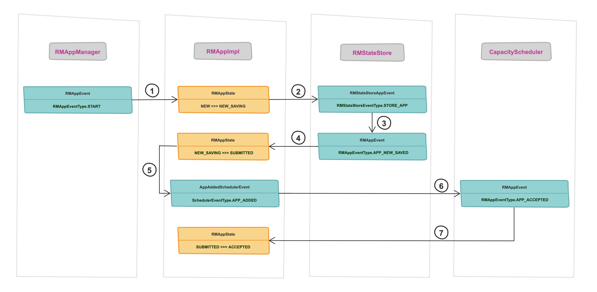

# YARN 任务跟踪探明 (六)

 

## 从 ACCEPTED 到 RUNNING

* [先放图](./6&#32;LaunchAM-2.md#1)
* [本篇提及到的组件](./6&#32;LaunchAM-2.md#2)
* [从 RMAppAttemptImpl 开始](./6&#32;LaunchAM-2.md#3)
* [TODO]()

 <h3 id="1"><b>先放图</b></h3>

 <h3 id="2"><b>本篇提及到的组件</b></h3>

* ResourceTrackerService
* CapacityScheduler
* RMAppManager
* RMStateStore
* RMAppImpl
* RMNodeImpl
* **RMAppAttemptImpl**
* **RMContainerImpl**

 <h3 id="3"><b>从 RMAppAttemptImpl 开始</b></h3>

在 RMAppImpl 响应了 `RMAppEventType.APP_ACCEPTED` 事件之后，随即便会触发 `RMAppAttemptEventType.START` 事件，在 RMAppAttemptImpl 内部同样维护着一个状态机，对这个事件的响应自然也会触发新的动作，同时使得 RMAppAttemptImpl 状态发送流转。

* RMAppAttemptImpl 从 `NEW` 到 `SUBMITTED`

    1. 状态流转触发动作 1：RMAppAttemptImpl 向 ApplicationMasterService 注册，为什么？***(TODO，about ApplicationMasterService)***
    2. 状态流转触发动作 2：RMAppAttemptImpl 向 CapacityScheduler 发送 SchedulerEventType.APP_ATTEMPT_ADDED 事件
    3. 完成本次动作后，RMAppAttemptImpl 的状态从 `NEW` 转移到 `SUBMITTED`

* RMAppAttemptImpl 从 `SUBMITTED` 到 `ATTEMPT_ADDED`

    1. CapacityScheduler 接收到 SchedulerEventType.APP_ATTEMPT_ADDED 事件：
       1. 根据 ApplicationId，将本次 “重试” 实例绑定到之前 RMAppImpl 提交给 CapacityScheduler 应用调度实例(FiCaSchedulerApp)上
       2. 将本次 “重试” 实例提交到指定 YARN 队列中
       3. 向 RMAppAttemptImpl 回传 RMAppAttemptEventType.ATTEMPT_ADDED 事件

    2. RMAppAttemptImpl 接收到 RMAppAttemptEventType.ATTEMPT_ADDED 事件
       1. 状态流转触发动作：new ScheduleTransition()
          1. 按照 `ApplicationMasterProtocol` 协议，RMAppAttemptImpl 实例(代表了本次 AM) 需要通过 allocate 接口来向 ResourceManager 提供其需要申请的**资源列表**，CapacityScheduler 会根据 applicationAttemptId 找到之前已经记录下来的应用调度实例(FiCaSchedulerApp)，并更新其资源申请相关信息。更新完成之后，CapacityScheduler 等待 NodeManager 下一次心跳来取走本次应用已经准备好的资源请求。
       2. NodeManager 心跳归来，领取资源请求
          1. NodeManager 通过 `ResourceTracker` 协议向 RM 发送心跳，ResourceTrackerService 在接收到心跳后会向 RMNodeImpl(该心跳节点的实例) 发送 `RMNodeEventType.STATUS_UPDATE` 事件。
          2. RMNodeImpl 会根据心跳更新 node 以及 container 的状态，然后再向 CapacityScheduler 发送 `SchedulerEventType.NODE_UPDATE` 事件。
          3. CapacityScheduler 会对该 Node 节点的信息进行更新，并根据节点资源的使用情况，按照顺序为应用创建 container 请求，并将 container 分配给 Node 节点。这个过程中会先创建 RMContainerImpl 实例，用来维护该 container 相关信息。在 RMContainerImpl 初始化结束之后，会向 RMAppAttemptImpl 发送 `RMAppAttemptEventType.CONTAINER_ALLOCATED` 事件，通知 RMAppAttemptImpl 符合条件的 container 以及初始化完成。
          4. RMAppAttemptImpl 收到事件之后，会

       3. 完成本次动作后，应用状态从 `RMAppAttemptState.SUBMITTED` 转为 `RMAppAttemptState.ATTEMPT_ADDED`

 <h3 id="9"><b><i>相关链接</i></b></h3>

 

---

 

### **[回到目录](./README.md)**